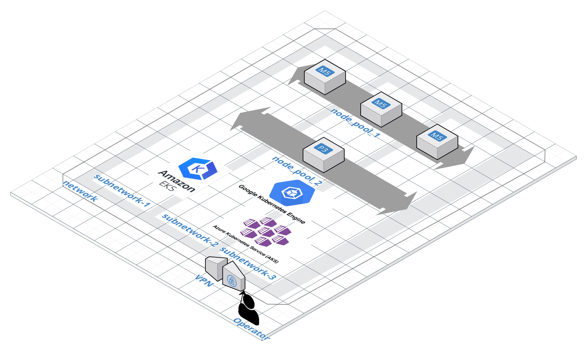

<!-- markdownlint-disable MD033 -->
<h1>
    
    Fury EKS Installer
</h1>
<!-- markdownlint-enable MD033 -->

<!-- <KFD-DOCS> -->

**Fury EKS Installer** deploys a production-grade Kubernetes Fury cluster on Amazon Elastic Kubernetes Services (EKS).

If you are new to Kubernetes Fury please refer to the [official documentation][kfd-docs] on how to get started.

## Modules

The installer is composed of three terraform modules:

|            Module             |                       Description                      |
| ----------------------------- | ------------------------------------------------------ |
| [VPC][vpc-module]             | Deploy the necessary networking infrastructure         |
| [VPN][vpn-module]             | Deploy the a VPN Server to connect to private clusters |
| [EKS][eks-module]             | Deploy the EKS cluster                                 |

Click on each module to see its full documentation.

## Architecture

The EKS installers deploys and configures a production-ready EKS cluster without having to learn all internals of the service.

The [EKS module][eks-module] deploys a **private control plane** cluster, where the control plane endpoint is not publicly accessible.

The [VPC module][vpc-module] setups all the necessary networking infrastructure.
The [VPN module][vpn-module] setups one or more bastion hosts with an OpenVPN server.

The bastion host includes an OpenVPN instance easily manageable by using [furyagent][furyagent] to provide access to the cluster.

> 🕵🏻‍♂️ [Furyagent][furyagent] is a tool developed by SIGHUP to manage OpenVPN and SSH user access to the bastion host.

## Usage

> ⚠️ **WARNING**:
> if you are upgrading from v1.9.x to v1.10.0, please read [the upgrade guide](docs/upgrades/v1.9-to-v1.10.0.md) first.

### Requirements

- **AWS Access Credentials** of an AWS Account with the following [IAM permissions](https://github.com/terraform-aws-modules/terraform-aws-eks/blob/master/docs/iam-permissions.md).
- **terraform** `0.15.4`
- `ssh` or **OpenVPN Client** - [Tunnelblick][tunnelblick] (on macOS) or [OpenVPN Connect][openvpn-connect] (for other OS) are recommended.

### Create EKS Cluster

To create the cluster via the installers:

1. Use the [VPC module][vpc-module] to deploy the networking infrastructure

2. (optional) Use the [VPN module][vpn-module] to deploy the openvpn bastion host

3. (optional) Configure access to the OpenVPN instance of the bastion host via [furyagent][furyagent]

4. (optional) Connect to the OpenVPN instance

5. Use the [EKS module][eks-module] to deploy the EKS cluster

Please refer to each module documentation and the [example](example/) folder for more details.

> You can follow the [Fury on EKS quick start guide][fury-eks-quickstart] for a more detailed walkthrough

## Useful links

- [EKS pricing](https://aws.amazon.com/eks/pricing/)
- [Reserved EC2 Instances](https://aws.amazon.com/ec2/pricing/reserved-instances/)
- [Managing users or IAM roles for your cluster](https://docs.aws.amazon.com/eks/latest/userguide/add-user-role.html)
- [Create a kubeconfig for Amazon EKS](https://docs.aws.amazon.com/eks/latest/userguide/create-kubeconfig.html)
- [Tagging your Amazon EKS resources](https://docs.aws.amazon.com/eks/latest/userguide/eks-using-tags.html)

<!-- Links -->

[eks installer docs]: https://docs.kubernetesfury.com/docs/installers/managed/eks/
[fury-eks-quickstart]: https://docs.kubernetesfury.com/docs/fury-on-eks
[vpc-module]: https://github.com/sighupio/fury-eks-installer/tree/master/modules/vpc
[vpn-module]: https://github.com/sighupio/fury-eks-installer/tree/master/modules/vpn
[eks-module]: https://github.com/sighupio/fury-eks-installer/tree/master/modules/eks
[kfd-docs]: https://docs.kubernetesfury.com/docs/distribution/

[furyagent]: https://github.com/sighupio/furyagent
[tunnelblick]: https://tunnelblick.net/downloads.html
[openvpn-connect]: https://openvpn.net/vpn-client/

<!-- </KFD-DOCS> -->
<!-- <FOOTER> -->

### Reporting Issues

In case you experience any problem with the module, please [open a new issue](https://github.com/sighupio/fury-eks-installer/issues/new).

## License

This module is open-source and it's released under the following [LICENSE](LICENSE)

<!-- </FOOTER> -->
